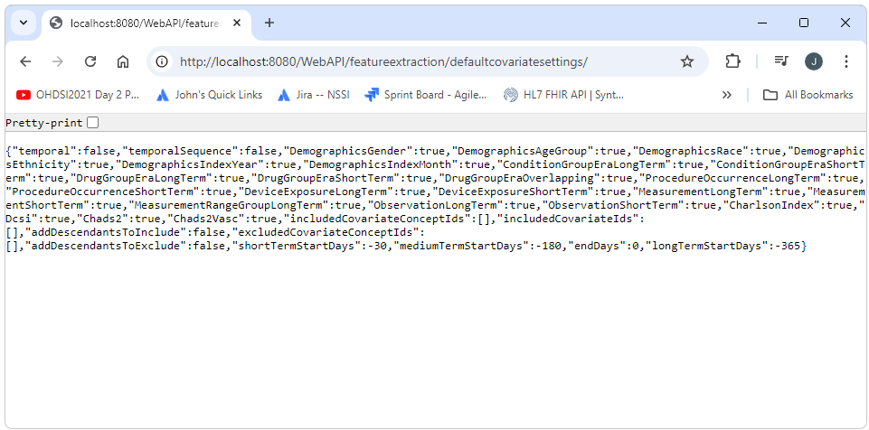

<!--
*
* Javascript
*
-->

<!--
*
* Introduction
*
-->

<h2>Introduction</h2>

  This document will walk you through setting up a development environment for WebAPI and Atlas development. 
  This will include:
  <ul>
    <li>Downloading and installing dependent software and tools</li>
    <li>Forking the projects from Github</li>
    <li>Running and debuging the applications in your IDE</li>
    <li>Committing your updated code back up to Github</li>
    <li>Creating a pull request</li>
  </ul>
  The environment created here will sit on top of Broadsea. 
  The environment created here will use Eclipse as an IDE. 

<!--
*
* Installations
*
-->

<h2>Installations</h2>

  Downloading and installing of the the underlying dependent software is described in detail in the 
  <a href="./quick-start.html">Quickstart Guide</a> (The Run section at the very end of the document can be skipped). 
  All of the underlying software required for your development environment will be installed by following these instructions,
  except for the IDE. The IDE will be installed separately.
  In this case Eclipse will be used as described below.
  The process consists of basically downloading and running an installer 
  and then running a couple of installers that could not be automated. 
  Details on exactly what software is installed can be found in the Prerequisites section of the
  <a href="./introduction.html">Introduction</a> documentation. 

<!--
*
* Fork
*
-->

<h2>Fork WebAPI</h2>

  In order to manage our changes and keep them as isolated as possible we will be forking and branching our code.
  Forking means creating a copy of a repository in another users account.
  Branching means creating a copy of the code base in the same repository.
  To create a fork of the WebAPI project, log in to your personal Github account and navigate to 
  <a href="https://github.com/OHDSI/WebApi">https://github.com/OHDSI/WebApi</a>.
  In the upper right corner, select "fork" and then "create new fork". 
   
  
   
   
  If we now go back to our own account and repositories, we should see a copy of WebAPI. 
   
  
   
   
  We can now create the branch we are going to work in by navigating to our fork of the repository 
  (for me this is https://github.com/greshje/WebAPI)
  and then selecting the branches dropdown, entering the name of the branch we want to create,
  and then selecting Create Branch as shown below.
   
  
   
   
  Next we clone our fork of the repository and checkout the branch we've created
  by opening a cmd window, navigating to our workspace folder and executing the commands shown below.
  (be sure to use the url for your fork, i.e. your personal github account)
<pre class="pre-scrollable">
git clone https://github.com/greshje/WebAPI
cd WebAPI
git checkout gresh-test-2024-10-13
</pre>

<!--
*
* Stop Postgres
*
-->

<h2>Stop PostgreSql</h2>

  Before starting Broadsea it is necessary to stop any local instance of PostgreSql that might be running.
  If the local instance of PostgreSql is not stopped,
  attempts to connect to the Broadsea instance of PostgreSql will connect to the local instance.
  This usually results in a wrong password error.
  To stop the service, open services and stop any running instance of PostgreSQL Server.
   
  

<!--
*
* Start Broadsea
*
-->

<h2>Start Broadsea</h2>

  Start Docker Desktop if it is not already running.
  Start Broadsea by executing C:\\_YES_POLITES\\workspace\\Broadsea\\start.bat
  If you want to make sure you are using a fresh install of Broad sea, run clean-docker.sh before starting Broadsea.
  clean-docker.sh will remove ALL containerized applications from your Docker instance.
  This can be confirmed by running show-docker.bat.
  The show-docker.bat script will show all of the volumes, images, and containers that exist on the Docker instance.
  To complete the cycle, Broadsea can be stopped by running stop.bat. 
<pre class="pre-scrollable">
clean-docker.sh
show-docker.bat
start.bat
stop.bat
</pre>

<!--
*
* Open in Eclipse
*
-->

<h2>Open in Eclipse</h2>

  An instance of Eclipse is included in the _YES_POLITES installation.
  Open Eclipse by executing C:\\_YES_POLITES\\eclipse\\eclipse.exe (use the default workspace).
  Import the WebAPI project by right clicking on the Navigator pain and selecting import...
   
  
   
   
  Select Maven->Existing Maven Projects.
   
  
   
   
  Navigate to the C:\\_YES_POLITES\\workspace\\WebAPI folder.
  
   
   

<!--
*
* add settings.xml file
*
-->

<h2>Add settings.xml File</h2>

  WebXML requires a configuration file.
  Create a top level folder called WebAPIConfig.
  Add this <a href="./img/dev-env/settings.xml" download>settings.xml</a> file to that folder.
  (you'll need to right click and select download as this server does not support downloadable links for security purposes).
   
  

<!--
*
* Configure Project
*
-->

<h2>Configure Project</h2>

  In order to run and debug WebAPI in an IDE two parameters need to be defined:
  The settings.xml file to use and the profile to use.
  These are the parameters that are used when WebAPI is built from the command line as shown below.
<pre class="pre-scrollable">
mvn clean package -DskipUnitTests -DskipITtests -s WebAPIConfig/settings.xml -P webapi-postgresql
</pre>
  <!-- set settings.xml -->
  <h3>Set settings.xml</h3>
  The WebAPIConfig/settings.xml file added earlier will be used for the settings file.
  To set this as the settings file, select Window->Preferences.
  Search for settings, then select User Settings.
  In the User settings option, Browse to the WebAPIConfig/settings.xml file and select Apply and Close.
   
  
  <!-- set profile -->
  <h3>Set profile</h3>
  To set the profile, right click on the WebAPI project then select Properties.
  In the Active Maven Profiles text box enter webapi-postgresql.
  

<!--
*
* Deploy
*
-->

<h2>Deploy</h2>

  The WebAPI application can now be deployed to the internal Eclipse Tomcat server.
  To deploy to the server, select the Servers tab at the bottom of the screen.
  Right click on the Tomcat server and select Add and Remove.
  Select the WebAPI application then select Add and Finish.
   
  

<!--
*
* Start Tomcat
*
-->

<h2>Start Tomcat</h2>

  Tomcat is started by right clickin on the Tomcat server and selecting either Debug or Start.
  For this exmple Debug will be used.
  The server startup takes a few minutes and will lie to you, saying it is done several times.
  If the service is call before it is done starting up the client will usually just wait (rather than give an error).
   
  

  
<!--
*
* Confirm Success
*
-->

<h2>Confirm Success</h2>

  We can confirm that we have successfully deployed the service by opening a browser and calling one of the end points.
  For this example the url below can be used.
  A successful outcome should look something like the screen shot shown below.
<pre class="pre-scrollable">
http://localhost:8080/WebAPI/featureextraction/defaultcovariatesettings/
</pre>
  

<!--
*
* Debugging
*
-->

<h2>Debugging</h2>

  To step through code, set a break point by double clicking in the gutter to the left of the line number.
  Step, step into, step out of, etc. are at the top of the screen.
  For this example we set a break point on line number 33 of the FeatureExtractionService class.
  The service was then called to get to the break point.
<pre class="pre-scrollable">
http://localhost:8080/WebAPI/featureextraction/defaultcovariatesettings/
</pre>
  

<!--
*
* Additional Resources
*
-->

<h2>Additional Resources</h2>

  Some additional resources that might be useful include the following.
  <ul>
    <li>
      <b>API Documentation:</b> Documentation for the endpoints of WebAPI is available at
      <a href="http://webapidoc.ohdsi.org/" />http://webapidoc.ohdsi.org/</a>.
      Note that the endpoints are in groups on the right side of the page.
    </li>
  </ul>

