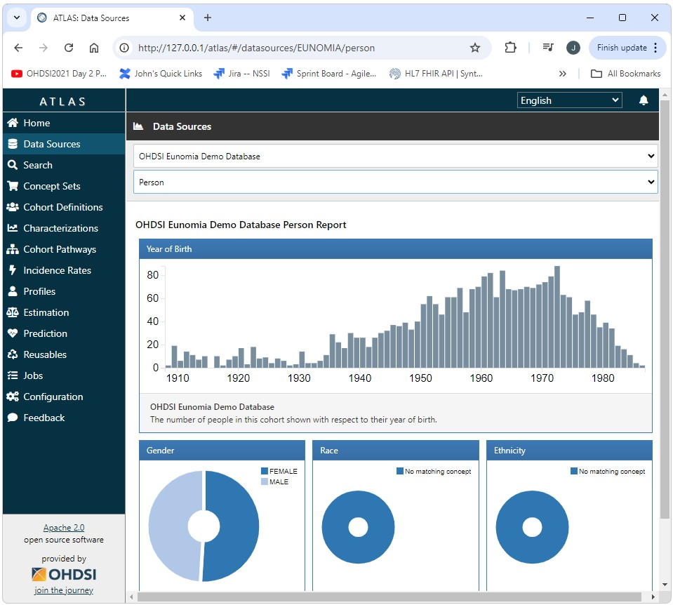
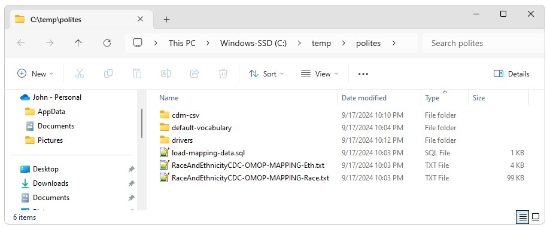

<!--
*
* Introduction
*
-->

<h2>Polites and Broadsea in a Nutshell</h2>

Polites is a Java based tool that enables the automation of complete OHDSI implementations for Broadsea based OHDSI deployments. 

Broadsea is an amazing tool that enables the reliable deployment of a complete OHDSI implementation repleate with a demo/test Common Data Model (CDM) instance.  

However, creating a production instance of a CDM and getting it connected to Broadsea is a lengthy meticulous process.  

Polites provides a way to automate this process and includes tools that can be used for the maintenance of existing production deployments.  

<!--
*
* Creating an Instance of Broadsea
*
-->

<h2>Creating an Instance of Broadsea</h2>

  

    Creating an instance of Broadsea is very easy, very reliable, and requires very few dependencies.  
  

  

    To install Broadsea you will need an instance of Java (a correct version), an instance of Git (a correct version), and an instance of Docker (a correct version)
  

  

    After the dependencies are installed, installing Docker is as simple as using Git to clone Broadsea from Github and checking out the version you want. After that Broadsea can be started by simply starting Docker from the Broadsea directory using docker-compose --profile default up -d. 
  

  

    The entire process is shown below.  
    <pre class="preformatted">
git config --global core.autocrlf false
git clone https://github.com/OHDSI/Broadsea
cd Broadsea
git checkout v3.0.0
cd Broadsea
docker-compose --profile default up -d
    </pre>
  

  

    And just like that, we have an OHDSI stack up and running. We can now go and take a look at the demo database provided by Broadsea at 
    <a href="http://127.0.0.1/atlas/">http://127.0.0.1/atlas/</a>
  

  

    
  

<h3>What Broadsea Does</h3>

Broadsea provides a turn-key solution with unparalleled ease of use and a standardized stable production deployment that includes an instance of a Common Data Model replete with test data in PostgreSql.

<h3>What's Left to do Outside of Broadsea</h3>

  

    For virtually every user of Broadsea, there will come a time when there is a need to point to an instance of the CDM other than the demo instance that is included in Broadsea. 
  

  

    This could be a development or test instance that uses a different data set. This could be an instance that exists in a different DBMS such as SQL Server, PostgreSql, Databricks, Redshift, etc., or this could be the CDM for your production data. 
  

  

    Setting up this other CDM instance can be a lengthy meticulous process that for the most part occurs outside of Broadsea. 
  

  

    This process has been automated by Polites. 
  

<h3>An Example</h3>

  

    As an example, lets look at the steps required to manually set up a CDM instance in SQL Server and get Broadsea to point to it. 
  

  <h4>Set up for Broadsea</h4>
  <ul>
    <li>Install Java (the correct version)</li>
    <li>Install a Git client (a correct version)</li>
    <li>Install Docker (a correct version)</li>
    <li>Before we clone and check out Broadsea, remember that we need to use <i>git config --global core.autocrlf false</i></li>
    <li>Git clone Broadsea</li>
    <li>Git checkout the version of Broadsea we want to use</li>
    <li>Clear Docker of any previous version of Broadsea and possibly other application that may exist if this is not a new install of Docker</li>
    <li>
      Add postgresql.conf:
      <ul>
        <li>shared_buffers = 32GB</li>
        <li>work_mem = 32GB</li>
        <li>effective_cache_size = 32GB</li>
      </ul>
    </li>
    <li>
      Modifications to docker-compose.yml
      <ul>
        <li>mem_limit: 32g</li>
        <li>shm_size: 32g</li>
        <li>Mapping to resources file: - C:/temp:/temp</li>
        <li>Mapping to postgresql.conf: - ./postgresql.conf:/etc/postgresql/postgresql.conf</li>
      </ul>
    </li>
    
  </ul>
  <h4>Set up for SQL Server</h4>
  <ul>
    <li>Find and Install Microsoft SQL Server (a correct version)</li>
    <li>Download and install the JDBC Driver (the correct version)</li>
    <li>Download, install, and configure the DLL for the JDBC driver (the correct version)</li>
    <li>Enable TCP/IP</li>
    <li>Enable Mixed Mode Authentication</li>
    <li>Restart SQL Server</li>
  </ul>
  <h4>Databases, Users, Permissions, etc.</h4>
  <ul>
    <li>Create a SQL Server database for the CDM</li>
    <li>Create a login for uid/pwd authentication</li>
    <li>
      Grant privileges for login:
      <ul>
        <li>exec sp_addrolemember N'db_accessadmin', N' </li>
        <li>exec sp_addrolemember N'db_backupoperator', N' </li>
        <li>exec sp_addrolemember N'db_datareader', N' </li>
        <li>exec sp_addrolemember N'db_datawriter', N' </li>
        <li>exec sp_addrolemember N'db_ddladmin', N' </li>
        <li>exec sp_addrolemember N'db_owner', N' </li>
        <li>exec sp_addrolemember N'db_securityadmin', N' </li>
      </ul>
    </li>
    <li>Create the tables for the CDM database using the DDL files from the CDM</li>
    <li>Create a record in CDM_SOURCE</li>
    <li>Create or find a suitable vocabulary download from Athena</li>
    <li>Load the Athena files into the CDM Vocabulary tables</li>
    <li>Import your data into the CDM data tables (PERSON, MEASUREMENT, OBSERVATION, etc.)</li>
    <li>Create the indexes on the CDM using the DDL from the CDM</li>
    <li>Create the constraints on the CDM using the DDL from the CDM</li>
    <li>Create WEBAPI SOURCE and SOURCE_DAIMON records</li>
    <li>Create the Achilles results database</li>
    <li>Create the Achilles temp database</li>
    <li>Grant appropriate privileges to appropriate users on the Achilles results and temp databases</li>
    <li>Run Achilles</li>
  </ul>

<!--
*
* Automation with Polites
*
-->

<h2>Automation with Polites</h2>

  

    All of the above can be achieved using Polites in a few easy steps. Not only is the Polites process much easier it is much more consistent, repeatable, and reliable.  
    <ol>
      <li>
        Download and run the 
        <a href="https://www.dropbox.com/scl/fi/4aa2rwf4u9h3p8krrkaem/YesPolitesInstaller-1.1.002.exe?rlkey=y6zy3wmg0hmxdj1e0wnvhn1x6&st=nurxejii&dl=1">YesPolitesInstaller-1.1.002.exe</a>
      </li>
      <li>Run the SQL Server installer provided by the YesPolitesInstaller found in </li>
    </ol>
  

<!--
*
* A Note on resources
*
-->

<h2>A Note on Resources</h2>

  

    Setting up an OHDSI stack requires multiple resources such as JDBC database drivers, vocabulary files, mapping files, export files, etc. Polites stores these files online and they are downloaded as part of the Polites build process. This eliminates the need to hunt for, find, download, and install these files (often finding the wrong version and needing to start over again).
  

  

    All of the resources downloaded by Polites can be found in C:\\temp\\Polites. 
  

  

    
  

<!--
*
* Summary
*
-->

<h2>Summary</h2>

  

    <ul>
      <li>Polites provides an easy way to create a CDM and connect it to the OHDSI stack implemented by Broadsea</li>
      <li>This process is not only easier, but is also more reliable, consistent, and repeatable</li>
      <li>This process ensures that the compatable versions of components are used</li>
      <li>This process ensures stability by using code freezes and stable releases: Components are only versioned as part of planed development cycles, code freezes, and releases</li>
      <li>Polites also provides tools for common tasks such as importing and exporting data as csv</li>
      <li>Polites supports multiple DBMS implementations such as SQL Server, PostgreSql, Databricks, etc.</li>
      <li>The ability to import and export data in a common csv format alows Polites to be used to migrate CDM instances from one DBMS to another</li>
      <li>All configuration for Polites is in a small single properties file. This has several advantages including the ability to see the scope of all variables that are part of the build and to make all configureation changes in a single place. This also makes in incredibly easy to clone a system from one site to another. This ability is especailly useful for testing. Testing envrionments can be created and reproduced simply by sharing configuration files</li>
      <li>Polites solves the problems that arise from needing to correctly identify, locate, and download resources such as JDBC drivers, vocabulary files, and other resources: Resources are posted to accessable URLs and downloaded automatically as part of the Polites build. This capability is configurable. For example, a project could define their own complete Athena vocabulary and use Polites to distribute it to multiple sites.</li>
    </ul>
  

<!--
*
* Polites: What's in a Name
*
-->

<h2>Polites: What's in a Name</h2>

