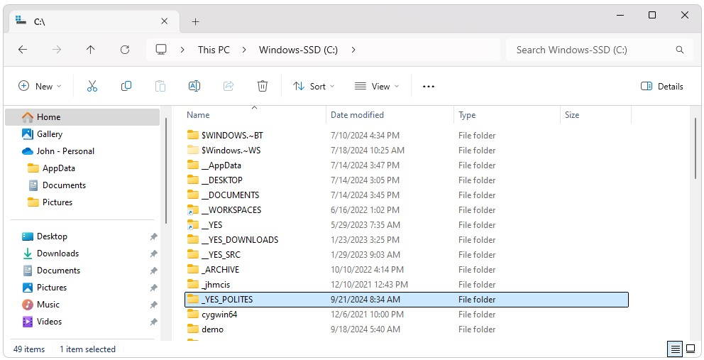
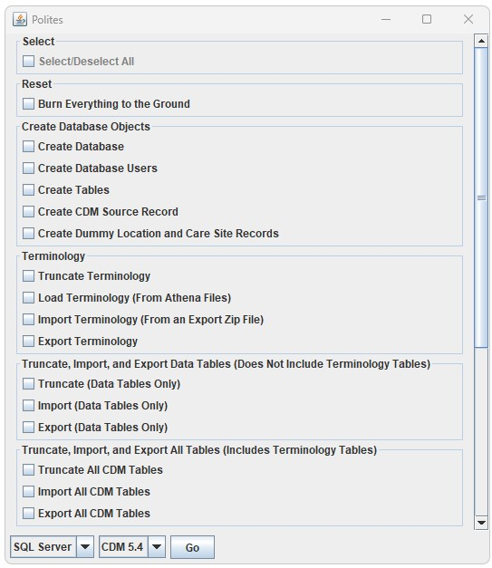
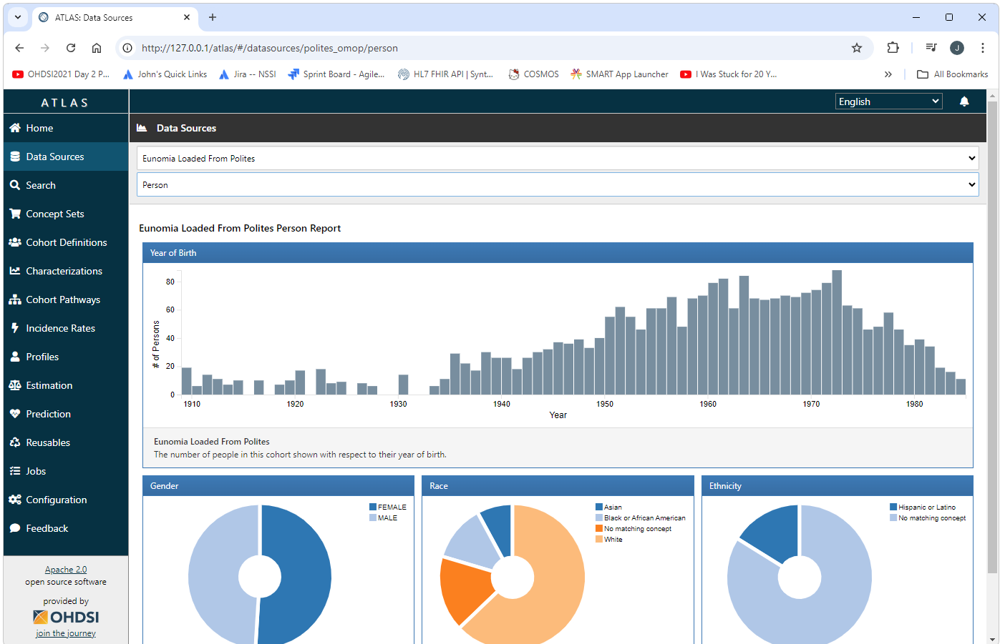

<!--
*
* Javascript
*
-->

<!--
*
* Introduction
*
-->

<h2>Introduction</h2>

Getting started with OHDSI using Polites invoves two steps. 
<ul>
  <li>Downloading and installing dependent software and tools</li>
  <li>Running Polites</li>
</ul>

<!--
*
* Install Dependencies
*
-->

<h2>Install Dependencies</h2>

  Installing and setting up an OHDSI CDM requires a number of software packages
  therefore Polites requires a number of software packages.
  Most of these dependencies can be installed an configured automatically using the 
  <a href="https://www.dropbox.com/scl/fi/534uvoc8y2iuz91tcx0ah/YesPolitesInstaller-1.2.061.exe?rlkey=nseujjakkumfm4oesp3j8d3lz&dl=1">YesPolitesInstaller.exe</a>. 
  To download and install dependent software download and run the 
  <a href="https://www.dropbox.com/scl/fi/534uvoc8y2iuz91tcx0ah/YesPolitesInstaller-1.2.061.exe?rlkey=nseujjakkumfm4oesp3j8d3lz&dl=1">YesPolitesInstaller.exe</a>. 
  This will install the C:\\_YES_POLITES folder.
  The installer gives you the option to install at a different location. 
  If you install at a different location, the installer will create _YES_POLITES as a short cut to that location. 
  For example, I generally install things to my D: drive as I have little space left on my C: drive. 

  
  

<!--
*
* Manual Installations
*
-->

<h2>Manual Installations</h2>

  There are a few installations that need to be done manually as shown below.
  After running YesPolitesInstaller.exe, the following installers should be run.
  Installing a database is optional if you will be using the PostgreSql database that is included in Broadsea.
  Before running any of the installers shown below, removing any existing versions of the software that may exist is recommended.
  <ul>
    <li>
      

        <b>RStudio (Optional):</b>
         
        Run the installers in the C:\\_YES_POLITES\\tools\\r folder in the order shown below.
        Note that R has already been installed at C:\\_YES_POLITES\\tools\\r\\R
        and this folder has been added to your path environment variable.
        Installing RStudio is optional.
        <ul>
          <li>RStudio-2024.04.2-764.exe</li>
          <li>rtools42-5355-5357.exe</li>
        </ul>
      

    </li>
    <li>
      

        <b>Docker: </b>
         
        Update the wsl before installing Docker
        by running wsl &minus;&minus;update from a cmd window.
         
        Run C:\\_YES_POLITES\\docker\\Docker Desktop Installer.exe.
      

    <li>
      

        <b>RTools:</b>
         
        Install RTools by running the RTools setup .exe file in C:\\_YES_POLITES\\tools\\r
      

    </li>
    <li>
      <b>Database:</b> 
      

        Note: Skip this step if you are setting up your WebAPI/Atlas development environment.
         
        Run any installers specific to the DBMS system you are using.
        These installers are found in C:\\_YES_POLITES\\databases.
        For example, if you are using Microsoft SQL Server, run the installers shown below
        (Note that the JDBC driver and .dll files required for SQL Server
        have already been installed in the sqlserver\\sqljdbc_12.6.2.0_enu folder
        and this folder has been added to your path environment variable).
        After running the above installers, open a cmd window as Administrator
        and run the init-sql-server.bat script.
        Running this script will update Sql Server configurations required for Broadsea
        such as mixed authentication mode and TCP/IP access.
        This script must be run as Administrator or it will not work.
        <ul>
          <li>SQL2019-SSEI-Eval.exe</li>
          <li>SSMS-Setup-ENU-20.2.exe</li>
          <li>init-sql-server.bat</li>
        </ul>
      

    </li>
  </ul>

  

<!--
*
* Run Broadsea
*
-->

<h2>Run Broadsea</h2>

  Broadsea can be downloaded and configured by simply running the install-broadsea.bat file found in _YES_POLITES/workspace. 
  After the script completes, Broadsea can be launched by simply starting Docker and then running the C:\\_YES_POLITES\\workspace\\Broadsea\\start.bat file. 

<!--
*
* Notes on Docker scripts
*
-->

<h2>Notes on Docker scripts</h2>

  

    Polites includes a number of scripts in the C:\\_YES_POLITES\\workspace\\Broadsea directory to make common tasks for Docker easer.  These scripts include the following:
    <ul>
      <li>
        <b>start.bat:</b> This script will start Docker using the appropriate settings for Broadsea. 
      </li>
      <li>
        <b>stop.bat:</b> This script will stop Docker using the appropriate settings for Broadsea. 
      </li>
      <li>
        <b>clean-docker.sh:</b> This script will remove all images, containers, and volumes from Docker.  
      </li>
      <li>
        <b>reset.bat</b>: This script will keep the Postgres database used by Broadsea and remove all other images, containers, and volumes from Docker.  
      </li>
      <li>
        <b>show-docker.bat</b>: This script will show all of the images, containers, and volumes currently in Docker. 
      </li>
      <li>
        <b>export-demo_db.bat</b>: This script can be used to export the demo_cdm as csv files.
      </li>
    </ul>
    
  

<!--
*
* Run
*
-->

<h2>Run</h2>

  Download the latest version of Polites from the 
  <a href="https://github.com/NACHC-CAD/polites/releases">Polites Releases</a> web site. 
  Unzip the provided zip file. 
  Make any required changes to ./auth/sqlserver-demo-app.properties (Polites will run out-of-the-box if you do not change the properties file). 
  Open a cmd window and run ./polites.bat. 

  

<!--
*
* Bounce
*
-->

<h2>Bounce</h2>

  Note that after running Polites (or making any other chages to the system),
  the server will need to be bounced by running the Broadsea stop.bat and start.bat scripts.

<!--
*
* View
*
-->

<h2>View</h2>

  You can now view the updates to your system in Atlas by opening a browser and navigating to
  <a href="http://127.0.0.1/atlas">http://127.0.0.1/atlas</a>
   
  

 
 
 

